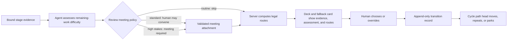

# Progressive DBTL gates over a non-linear stage graph

**Status:** Phase 0 owner-approved. Phase 1 implemented behind the default-off
feature flag; focused automated checks pass and the owner approved the manual
walkthrough on 2026-07-31 (park → approve recorded against cycle `b9e8cade`
in the isolated manual profile). Phase 2 is code complete behind the same
flags.

Owner-approved on 2026-07-31 against cycle `0bbcd8b9` (scenarios
`after-meeting`, `meeting-approve`, `post-meeting-revise`, `revise-park`):
the one-question gate records **Approve**, **Revise**, and **Park** correctly,
each as its own append-only edge; approval opens Reconciliation rather than the
blocked Build edge; and the revision round takes the chair-only route with its
reason recorded. A pre-0025 scenario also migrated forward cleanly on restore.

Still unverified by a person:

- the **reconvene** branch of the revision reading (an objection that needs an
  argument nobody made);
- the **Reject** verdict;
- the parent surface's lifecycle strip (`Design · open` / `· superseded` /
  `· consumed`, `Surface revision N`, `Open latest surface`), which has **no
  automated coverage at all**; and
- one uncached end-to-end smoke test through every changed stage, per the
  manual-pipeline runbook, before merge.

Known gap, not yet fixed: a revision round that dies mid-flight still says
nothing in chat, because the explanation rides on the round's own reply.
**Date:** 2026-07-29
**Scope:** Replace the uniform post-meeting human gate with a progressive gate
driven by a per-transition difficulty assessment; model a cycle as a recorded
walk over a stage graph (D→B→T→B→T→L, DBTDBTL, …) instead of four fixed
slots; extend meetings to Build, Test, and Learn; and make the registered
feedback deck the single human-decision surface at every stage transition.

## 1. Outcome

At every stage boundary the project owner sees one deck that:

1. shows what just concluded (meeting synthesis, build record, test outcome,
   or learn candidates) with the same disagreement-before-synthesis ordering
   the Design deck already uses;
2. shows an **agent-assessed difficulty** for the remaining work, labelled as
   the agent's view, with the reasons, and overridable;
3. offers the **legal next routes only**, server-computed from the current
   stage, its outcome, and the reconciliation/approval state:
   - *Revise here* — another round/attempt of the current stage;
   - *Add a step* — e.g. another Build after Test (DBTBT…);
   - *Go back to Design* — reopen D with everything learned since;
   - *Conclude with Learn* — the only terminal stage (including the existing
     no-candidate closure for inconclusive/invalidated outcomes);
   - *Park — work with the lead agent* — cycle stays open and held, ordinary
     requests route to the lead agent with the bound design package as context;
4. collapses the gate to **one recorded click** when the assessment is
   `routine`, keeps today's two-step submit-then-verdict flow at `standard`,
   and requires the full deck-feedback path at `high_stakes`; and
5. records every choice as a durable transition record naming who decided,
   what the agent recommended, and what evidence revision the decision bound.

The cycle's identity becomes its **path history**: `D→B→T→B→T→L` is one
cycle with six stage attempts, rendered in the rail as a timeline rather than
four checkboxes.

### 1.1 The operating principle

The progressive gate changes ceremony, not authority:



- **Evidence stays authoritative.** The assessor reads the bound stage result;
  it does not rewrite it.
- **Difficulty changes interaction depth.** `routine` means one bound click,
  `standard` means today's submit-then-verdict flow, and `high_stakes` means
  explicit feedback and, once Phase 3 is enabled, a required meeting.
- **Assessment precedes an optional review meeting.** For Build, Test, and
  Learn, the core stage record is assessed when it becomes reviewable; the
  result decides whether a review meeting is skipped, offered, or required.
  The meeting is an evidence attachment and does not trigger recursive
  reassessment. A new stage-attempt revision does. Design is the exception:
  its meeting creates the core Design evidence, so its assessment follows that
  meeting.
- **Legal routes come from policy.** The model cannot add an edge to the stage
  graph.
- **A person moves the path head.** No assessment, meeting, or chair result
  advances the cycle.
- **The transition row is the audit fact.** Refreshing the browser or restoring
  a checkpoint must reconstruct the same path from durable records.

## 2. Decisions already made (owner-confirmed)

These were settled in discussion and are not re-open in this plan:

| Decision | Choice |
| --- | --- |
| Difficulty source | **Agent-assessed per transition**, human-visible, human-overridable; never a silent default |
| Assessment cadence | **Every stage transition**, not once per cycle |
| Gate floor for `routine` | **One-click continue** — submit + approve recorded as a single server-owned review action |
| Cycle fate when parked | **Park, resumable** — Design (or current stage) stays held; ordinary requests route to the lead agent; the gate is returned to via the deck |
| Cycle shape | **Non-linear stage graph** — repeat, insert, or revisit stages; Learn concludes |
| Meetings | Extend to **Build, Test, Learn** (Test first); the per-transition assessment decides whether a stage's review meeting is skipped, offered, or required |
| Feedback surface | The **registered deck** is the human-input channel for all of the above |
| Reconciliation | **Not a cycle stage.** The stage graph's nodes are D, B, T, L only; data readiness/reconciliation is a dataset-scoped precondition that locks Build edges, not a step on the path |

### 2.1 Delivery rule: every phase is a visible vertical slice

A phase is not accepted from unit tests or database inspection alone. It must
ship with all of the following:

1. **Visible state:** one normal product surface shows what the phase added.
   A fallback parent-app card must show the same decision state when the deck
   cannot load.
2. **Named quiet checkpoint:** the manual pipeline can restore the state
   immediately before the new human action. Scenario names describe the state,
   not the branch or feature. The phase's scenario catalog records the expected
   path head, assessment, offered route slugs, and next action.
3. **One short happy path:** a tester can take the action and see the path head,
   review state, or meeting state change without opening SQL.
4. **One refusal path:** stale, forged, outcome-incompatible, or repeated input
   is visibly refused.
5. **Durability check:** reload and reopen reconstruct the same result.
6. **Evidence:** the tester records a screenshot of the visible state and the
   transition/surface identifier shown by the UI or support details.

The minimum phase demo should take less than ten minutes after restoring its
checkpoint. A separate uncached live-model smoke test remains required before
merge; checkpoint replay proves the recent slice, not the skipped model work.

## 3. Invariants that must survive every phase

These are the load-bearing rules from Phases 5–8 and the deck-feedback plan;
loosening the gate compresses *clicks*, never *authority*:

1. **A human records every gate decision.** The assessment widens or narrows
   the offered menu; it never advances a stage. Agent suggestions cannot
   auto-advance, and a judgement row stays a person's decision at the write
   boundary.
2. **`high_stakes` is sticky and fail-safe.** Assessor failure (no model
   configured, provider outage, unparseable reply) degrades to `standard` —
   today's behavior — never to `routine`. Lowering `high_stakes` requires the
   human's explicit override on the card, and the record shows it.
3. **One-click continue never skips the evidence.** The click lives on the
   deck that presents the review Markdown (listed first) and slides; the
   recorded approval binds the reviewed document's content hash exactly as a
   two-step approval does.
4. **Approvals bind; going back invalidates forward.** An approval binds
   dataset fingerprint + stage-spec version + policy version. Revisiting
   Design produces a new design revision, so downstream Build/Test approvals
   from the old revision are invalidated, not inherited. The path may loop;
   evidence bindings may not dangle.
5. **Routes are server-computed, deck-rendered.** The deck never invents an
   edge. A `not_supported` Test cannot offer promotion; an unreconciled
   dataset cannot offer Build; a completed chair cannot offer a
   `decision_request`. This is the Phase 7 outcome-compatible-routes rule
   applied at every boundary through the intents-only deck channel.
6. **Test outcomes stay computed.** A Test meeting argues the validity pack;
   it cannot override the computed `supported` / `not_supported` /
   `inconclusive` / `invalidated` outcome, and no chair synthesis or generic
   approval can bypass that computation.
7. **Learn candidates stay provisional.** A Learn meeting recommends;
   promotion and publication remain separate human decisions with their own
   audit records. Nothing in this plan can implicitly publish.
8. **Decks stay inert files.** Persisted HTML activates only through the
   authenticated parent after exact SHA-256 + scope + state verification;
   the iframe emits bounded intents; the backend revalidates and keeps a
   single-use action ledger. Regeneration supersedes rather than mutates.
9. **The debate-completeness rule holds for every meeting.** A chair result
   is insufficient without a validated independent-position report and a
   validated red-team report (`159065e7`); provider failures and contract
   rejections are audit records, not debate input, at every stage.

## 4. Core model: transition records and the stage graph

New durable pieces (backend authority; SQL layer owns the tables):

- **`dbtl_stage_transitions`** — one row per human-decided boundary:
  `(cycle_id, seq, from_stage, from_attempt, chosen_route, to_stage,
  assessed_difficulty, assessment_rationale_ref, human_override,
  offered_routes, decided_by, decision_surface_id, evidence_hash,
  dataset_fingerprint, stage_spec_version, policy_version, decided_at)`.
  Append-only; the path history *is* this table ordered by `seq`.
- **`deerflow.dbtl.stage_routes`** — pure-value computation of legal edges
  from `(stage, attempt outcome, reconciliation state, approval bindings)`.
  Generalizes the Phase 7 post-Test route chooser; the Phase 7 chooser
  becomes one call site. Every route carries a stable slug id, a label, and
  a value stating what choosing it means — the `decision_request` shape.
  The graph's nodes are **Design, Build, Test, Learn only**. Reconciliation
  is not a node and never appears as a destination: it is dataset-scoped
  precondition state that locks Build edges until every required matrix row
  is settled. Where Phase 7 offered "Reconciliation" as a route, the
  re-expression renders a **blocked Build edge with the reason** instead —
  the human resolves the matrix through the existing reconciliation surface
  (outside the path), and the Build edge unlocks; no transition row is
  written for data work.
- **`deerflow.dbtl.transition_assessment`** — one-shot `nostream` call (same
  pattern as `recommend_depth` and the roster writer) classifying the
  *remaining work* into `routine | standard | high_stakes` with recorded
  reasons. Parsing is permissive; malformed output costs the assessment
  (→ `standard`), never the transition.
- **Cycle state** (`deerflow.dbtl.cycle_state`) gains the parked flag and
  path-position accessors; "current stage" becomes "head of the path".

The Phase 0 route-legality fixture is also the human-readable route catalog.
For each scenario state it records the inputs above, allowed route slugs, and
refusal reason for every other slug. Unit tests consume the same fixture that
the manual scenario catalog references, so the expected menu cannot drift into
an undocumented policy.

Frontend: the project rail renders the path as a timeline of attempts; the
route chooser and assessment render inside the deck (and its fallback card),
not in the rails — rails stay navigation/summary/review per the repo
conventions.

## 5. Phases

Each phase is independently shippable, config-gated, and leaves the previous
behavior reachable by flag for one release.

### Phase 0 — Stage-graph foundation + read-only path strip

**Implementation status (2026-07-29):** code complete. The Test validity write
path now consults `stage_routes`, transition rows refuse ORM update/delete,
backfill replay and real Test→Design revisit are covered, checkpoint manifests
can record their expected head/routes/next action, and the path strip exposes
its latest `dst-…` record id. Acceptance remains open until the two named
checkpoints below are recaptured from an actionable `stage_review` deck and the
manual walkthrough is recorded.

- Introduce `dbtl.progressive_gate` with default `false`. In this phase it gates
  only the new read model and path strip; Phase 1 puts new decision behavior
  behind the same switch.
- Migration `0024_dbtl_stage_transitions`: the table above, plus backfill of
  linear transitions for existing cycles (one synthetic row per already-passed
  gate, marked `backfilled=true`).
- `stage_routes` implemented and unit-tested as values; Phase 7's post-Test
  reviewer routing re-expressed as a call into it. Golden tests assert the
  same routes for the same inputs, with one deliberate exception: the old
  "Reconciliation" route becomes a blocked Build edge carrying the
  unreconciled-rows reason (§4), and a golden test asserts that mapping
  explicitly.
- `LiveStageAdapter` writes a transition record wherever a gate decision is
  already recorded today; reads nothing new.
- Add a minimal, read-only path strip to the existing cycle/review surface:
  `Design 1 → Build 1 → Test 1`, with the current head, repeated attempts, and
  invalidated downstream attempts visually distinct. This is the first thin
  rendering of the transition table, not the final Phase 4 timeline. With the
  feature flag off, the existing four-stage display remains unchanged.
- **Tests:** route legality matrix (every stage × outcome × reconciliation
  state), invalidation on design revisit, append-only enforcement, backfill
  idempotency.
- **Visible acceptance:** after the existing Design verdict, the path strip
  gains `Design 1 → Build 1`; reopening Design adds `Design 2` and marks
  evidence descended from `Design 1` invalidated rather than silently reusing
  it.
- **Manual checkpoints:** capture `design-awaiting-verdict` before the existing
  verdict and `design-1-path-recorded` after it.
- **Manual walkthrough:**
  1. Restore `design-awaiting-verdict`, approve through today's flow, and
     verify the path strip adds exactly one transition.
  2. Refresh and reopen the project; verify the same attempt numbers and head.
  3. Repeat the consumed action; verify no duplicate path item is added.
  4. Reopen Design and verify invalidation is visible on the old forward path.
- **Rollback:** the table is additive; `dbtl.progressive_gate=false` keeps the
  old four-stage display and behavior. Transition records still accumulate so
  rollback does not create an audit gap.

### Phase 1 — Assessment + progressive gate + park (Design→Build first)

**Implementation status (2026-07-29):** code complete behind
`dbtl.progressive_gate`. The Design deck and parent fallback expose the
assessment/rationale, legal routes, explicit override, and parked state;
one-click routine approval and two-step review write the same evidence-bound
review/transition facts; Park persists an unapproved hash binding and routes
ordinary selected-cycle work through the lead agent until a gate action clears
it. Automated coverage pins fail-safe assessment, sticky high-stakes override,
one-click equivalence, Park/unpark, lead-agent context, and stale/forged
intent refusal. The four named checkpoints and manual walkthrough below are
not yet captured.

- Config: add `dbtl.transition_assessor_model_name` (default `null` → every
  transition is `standard`, i.e. today's flow) under the Phase 0 master switch.
- For the Design-first slice, `transition_assessment` runs when the completed
  meeting makes the Design attempt reviewable. Its result and rationale ride
  on the post-meeting deck as a labelled, overridable chip. The override and
  the original assessment are both persisted on the transition record.
- Route chooser on the deck: `routine` exposes one-click **Continue to
  Build** (submit + approve as one recorded review action, evidence-hash
  bound); `standard` keeps two-step; `high_stakes` requires the full deck
  feedback path. All three record through the existing single-use action
  ledger.
- **Park:** choosing "work with the lead agent" sets the parked flag;
  cycle-scoped requests then route to the lead agent with the design package
  carried hash-bound (the `_approved_design_brief` mechanism, extended to
  held-but-parked packages and clearly marked *unapproved* when the gate has
  not passed). This inverts the documented pointer-loop limitation: parked
  cycles answer ordinary questions; the gate is returned to via the deck.
- **Tests:** assessor fail-safe (`null` model, outage, malformed → standard),
  sticky high-stakes (no downward path without `human_override`), one-click
  record equivalence (single action produces the same review record fields as
  submit-then-approve), park routing (ordinary request reaches lead agent
  with brief; gate still reachable; unpark on gate action), forged/stale
  deck intents rejected.
- **Visible acceptance:** the Design deck and fallback card both show:
  `Agent assessment: routine | standard | high stakes`, rationale, any human
  override, only legal next routes, and a clearly labelled parked state. The
  path strip updates only after the human action succeeds.
- **Manual checkpoints:** capture `design-gate-routine`,
  `design-gate-standard`, `design-gate-high-stakes`, and `design-parked`.
  These may use recorded assessor output; run one separate live-assessor smoke
  test.
- **Manual walkthrough:**
  1. Restore each difficulty checkpoint and verify the expected interaction
     depth: one click, two steps, or full feedback.
  2. From `design-gate-high-stakes`, lower the difficulty and verify the deck
     requires and displays an explicit human override.
  3. Park the cycle, send an ordinary cycle-scoped question, and verify the
     lead agent answers with the package labelled **unapproved**.
  4. Reopen the deck, continue to Build, refresh, and verify the park marker is
     gone and exactly one evidence-bound transition was recorded.
  5. Replay the old deck intent and verify a visible stale/consumed refusal.
- **Rollback:** `dbtl.progressive_gate=false` restores the uniform gate;
  transition records keep accumulating either way.

### Phase 2 — Stage-agnostic feedback surfaces

**Implementation status (2026-07-31):** code complete behind the existing
deck-feedback/progressive-gate rollout. Migration `0025` uses additive stage
and revision columns so legacy Design surfaces remain valid; canonical
stage-feedback APIs, stage intent enforcement, lifecycle headers, successor
links, and compatibility wrappers are covered by migration, repository,
router, and frontend tests. The producer side is now stage-generic too, so a
non-Design surface can be registered at all. Manual checkpoints are not yet
captured; the walkthrough below maps onto the existing manual scenarios as
`design-awaiting-verdict` (pre-0025 legacy open), `after-meeting`
(post-0025 open + a migrated superseded chain), and a `design-surface-consumed`
capture of the Phase 1 result.

Note that no automated test covers the parent surface's lifecycle header
strings (`Design · open`, `Surface revision N`, `Open latest surface`), so
those are manual-only.

- Migration `0025`: generalize `dbtl_design_feedback_surfaces` /
  `dbtl_design_feedback_actions` with a `stage` dimension (new tables +
  compatibility views, or column + backfill — decide at implementation
  against SQLite/PostgreSQL parity; approval-record shape must not change).
- Per-stage **allowed-intent declarations**: Design keeps its current set;
  Test decks may answer a paused chair and submit but verdict options are
  constrained to outcome-compatible routes; Learn decks may recommend
  promotion but never record one; every stage gets the route-chooser intents
  from Phase 1.
- Design traffic flows through the generalized path first (proving the
  migration before any new meeting exists).
- The parent surface shows a small stage/state header (`Design · open`,
  `Design · consumed`, or `Design · superseded`) and its surface revision.
  This makes the generalized ownership and lifecycle inspectable without
  exposing implementation-oriented table names.
- **Tests:** legacy Design surfaces stay read-only/valid; intent matrix per
  stage (each disallowed intent rejected server-side, not just unrendered);
  hash/scope/state verification unchanged; supersession chains intact across
  the migration.
- **Visible acceptance:** an old Design deck and a newly generated Design deck
  have the same user actions, while their parent cards show the correct
  lifecycle. Opening a superseded surface presents a read-only banner and a
  link to the current surface.
- **Manual checkpoints:** preserve one pre-migration
  `design-surface-legacy-open` checkpoint and capture
  `design-surface-current-open` plus `design-surface-superseded` after the
  migration.
- **Manual walkthrough:**
  1. Restore the legacy checkpoint, let startup migrate it, and complete its
     still-legal Design action.
  2. Restore the current checkpoint and perform the same action; compare the
     visible receipt fields and resulting path item.
  3. Restore the superseded checkpoint, open the old deck, and verify it is
     read-only and points to the newest deck.
  4. Attempt a disallowed or already-consumed intent and verify the parent
     surface shows the server refusal.
- **Rollback:** compatibility views keep the Phase 5 deck-feedback rollback
  flag (`dbtl.design_deck_feedback`) working unchanged.

### Phase 3 — Stage meetings, delivered one at a time

**Implementation status (2026-07-31):** policy and contract foundation
complete, execution/UI rollout still default-off. The three pinned review
StageSpecs, independent flags, deterministic convening gate, server intent
matrix, and Test-outcome/Learn-authority immunity are implemented and tested.
The shared producer prerequisite is now done: the deck/feedback-surface path in
`LiveStageAdapter` is stage-generic (`_FeedbackSurfacePlan.stage`,
`_plan_feedback_surface(stage=...)`, `_register_feedback_surface`,
`_write_council_deck(stage=...)`), with Design output byte-identical.

Still to implement before any `dbtl.stage_meetings.*` flag can be enabled, in
dependency order:

1. **Convening decision.** `meeting_gate()` and
   `DbtlStageMeetingsConfig.enabled_for()` still have zero production callers;
   the flags reach only `/api/features`. Nothing joins an assessment, the flag,
   and the gate into something a person can see.
2. **A pre-meeting deck for a non-Design stage.** Build/Test/Learn produce no
   deck today, so there is no surface to carry the gate. This needs a renderer
   over stage evidence (Test: computed outcome + validity pack) rather than
   over a chair result, since no meeting has happened yet.
3. **Read-model exposure.** `filter_stage_feedback_intents` is a whitelist
   filter that can only remove, so `convene_review_meeting` and `choose_route`
   can never currently be offered; the read model also returns no meeting gate.
4. **A `convene_review_meeting` POST branch** that starts the meeting run in the
   originating conversation (the `chair_option` branch is the template), and
5. **Review-meeting dispatch** through the council machinery against
   `resolve_review_stage_spec(stage)`, recording output through
   `attach_meeting_to_core_evidence` and superseding the pre-meeting deck.

- New StageSpecs: `generic:test-review:v1`, then `generic:build-review:v1`,
  then `generic:learn-review:v1`, reusing roster proposal, preflight,
  participant cards, chair, consensus, deck renderer, and the
  debate-completeness rule as-is. What differs per stage is the question:
  - **Test** — red-team the validity pack: leakage, folds, holdout,
    ceiling/direction, reproducibility. The meeting output annotates the
    pack; the outcome computation is untouched (invariant 6).
  - **Build** — review the recorded execution: environment, code/config
    revisions, plan-vs-actual deviations, reproducibility; the red team
    attacks execution risk, not the scientific design. Plan-level objections
    resolve through *Revise here* (a new Build attempt), not a second
    pre-execution meeting point — every stage keeps exactly one meeting
    boundary, its review boundary.
  - **Learn** — argue which evidence-bound candidates merit promotion;
    output is a recommendation attached to candidates (invariant 7).
- **The assessment gates convening:** `routine` transitions skip the meeting
  (that is the cost story — routine cycles stay cheap); `standard` offers
  one; `high_stakes` requires one before the stage's gate can pass. Build,
  Test, and Learn are assessed from their core stage evidence before this
  choice. The meeting output is attached review evidence: it cannot rewrite
  the assessment, recursively demand another meeting, or change the stage's
  computed result. A revised stage attempt receives a new assessment.
- The first registered deck is the pre-meeting decision surface. At
  `standard` it offers **Convene review meeting** alongside the legal gate
  flow; at `high_stakes` it disables transition routes until that meeting is
  complete (unless the human explicitly lowers the assessment); at `routine`
  it offers no meeting. Convening opens the existing participant/depth
  preflight in the originating conversation. A completed meeting supersedes
  the pre-meeting deck with a new hash-bound deck containing the debate and
  legal routes. The old deck becomes visibly read-only.
- Implement and accept this as three independent subphases. Do not wait for
  all three meetings before exposing the first one:

#### Phase 3A — Test validity meeting

- **Visible acceptance:** the meeting and deck distinguish the computed Test
  outcome from the chair recommendation. Leakage, folds, holdout,
  ceiling/direction, and reproducibility disagreements appear before the
  synthesis. The legal route menu remains outcome-compatible.
- **Manual checkpoints:** `test-pack-routine`, `test-pack-standard`,
  `test-pack-high-stakes`, `test-meeting-paused`, and
  `test-meeting-complete`.
- **Manual walkthrough:** verify a routine pack skips, a standard pack offers,
  and a high-stakes pack requires the meeting; complete a meeting; verify that
  a chair claiming `supported` cannot change an `invalidated` computed
  outcome; try an incompatible route and observe the refusal; refresh and
  verify the outcome, meeting, and path are durable.

#### Phase 3B — Build execution-plan meeting

- **Visible acceptance:** the deck shows the approved design binding beside
  environment, code/config revisions, versioned outputs, and recorded
  deviations. The red team attacks execution risk rather than reopening the
  scientific design.
- **Manual checkpoints:** `build-plan-routine`, `build-plan-standard`,
  `build-plan-high-stakes`, and `build-meeting-complete`.
- **Manual walkthrough:** verify skipped, optional, and required convening;
  complete the meeting; revise Build once and see `Build 2` in the path; then
  revisit Design and verify both Build attempts are visibly invalidated.

#### Phase 3C — Learn candidate meeting

- **Visible acceptance:** the deck clearly separates provisional candidates,
  meeting recommendations, human promotion, and publication. A
  no-candidate closure remains available for compatible Test outcomes.
- **Manual checkpoints:** `learn-candidates-routine`,
  `learn-candidates-standard`, `learn-candidates-high-stakes`,
  `learn-no-candidate`, and `learn-meeting-complete`.
- **Manual walkthrough:** verify skipped, optional, and required convening;
  complete the meeting; confirm the recommendation promotes and publishes
  nothing; exercise the no-candidate close path; then perform promotion as a
  separate human action and verify publication still requires another action.

- **Tests:** per-stage golden meetings (roster, depth scoping, deck output),
  outcome-computation immunity (a Test chair asserting `supported` changes
  nothing), promotion immunity for Learn, meeting-skip at `routine`,
  meeting-required at `high_stakes`, and debate-completeness enforcement per
  stage. Each subphase adds its tests before its implementation.
- **Rollback:** per-stage flags `dbtl.stage_meetings.{build,test,learn}`
  (default `false`), independent of Phases 1–2.

### Phase 4 — Cutover and cleanup

- Replace the Phase 0 path strip with the complete non-linear timeline in the
  rail: attempts, loops, assessments, overrides, invalidations, park/resume,
  and the evidence/deck link for every human-decided edge. Keep a compact
  presentation by default and an expanded audit view on demand.
- Docs (`AGENTS.md`,
  `backend/AGENTS.md`, `frontend/AGENTS.md`, `CHANGELOG.md`); telemetry
  review of assessment accuracy (assessed vs overridden rates) before
  defaulting `dbtl.progressive_gate=true`; remove the documented pointer-loop
  limitation note; retire compatibility views after the one-release window.
- **Visible acceptance:** a restored `D→B→T→B→T→L` cycle reads as one cycle,
  not duplicated stage cards. Selecting an attempt opens the exact evidence
  and deck that its decision bound.
- **Manual checkpoints:** capture `loop-before-learn` with path
  `D→B→T→B→T`, `parked-mid-loop`, and `completed-loop`.
- **Manual walkthrough:**
  1. Restore `loop-before-learn`, expand the timeline, and verify attempt
     ordering, assessment/override labels, and evidence links.
  2. Conclude with Learn and verify the path becomes
     `D→B→T→B→T→L` without creating a second cycle.
  3. Restore `parked-mid-loop`, resume through its deck, and verify the same
     path head moves forward.
  4. Reload and reopen every linked attempt; verify hashes/surface revisions
     match and invalidated attempts cannot be acted on.
  5. Run one uncached end-to-end smoke test covering at least one repeat edge
     and one backward edge before default-on.

## 6. Config summary

```yaml
dbtl:
  progressive_gate: false            # Phase 0 read model; Phase 1 behavior
  transition_assessor_model_name: null  # null → every transition is `standard`
  stage_meetings:                    # Phase 3, per-stage
    build: false
    test: false
    learn: false
  # existing keys unchanged: mode, policy_version, council_model_name,
  # design_deck_feedback, proposals_visible, setup_draft_model_name
```

## 7. Risks and open questions

- **Assessment audit weakness (accepted):** a wrong `routine` call offers
  one-click on hard work. Mitigations: menu-only effect, sticky
  `high_stakes`, fail-safe to `standard`, both values on the record,
  telemetry review before default-on.
- **Parked-cycle context leak:** the lead agent receives an *unapproved*
  design brief; it must be marked as such so downstream stages cannot treat
  parked context as gate passage.
- **Path explosion:** no hard cap on repeats in this plan; `MAX_DESIGN_ROUNDS`
  stays per-stage. Whether a cycle needs a total-attempt ceiling is deferred
  until real usage shows one.
- **Migration shape for Phase 2** (new tables + views vs. stage column) is an
  implementation-time decision; the constraint is that existing approval
  records and the Phase 5 rollback flag survive byte-compatible.
- **Meeting cost:** three new meeting types × per-transition cadence is only
  affordable because `routine` skips convening; telemetry should confirm the
  skip rate before enabling stage meetings by default.
- **Build review is post-execution.** The review-boundary model (§1.1) means a
  Build meeting can flag a wasted build but cannot prevent one. Acceptable
  while Build is computational; if Build ever becomes physically expensive
  (wet-lab work), a pre-execution checkpoint would need its own design —
  deliberately deferred, not implied by this plan.

## 8. Test plan (cross-phase)

- TDD throughout (`backend/tests/`), extending
  `test_dbtl_live_stage_execution.py` and the deck/surface suites.
- Route-legality matrix and invalidation-on-revisit are Phase 0 gates for
  everything after.
- One focused manual pass per phase via the DBTL manual pipeline, restoring the
  closest phase-specific quiet checkpoint named above, then a full uncached
  smoke test through every changed stage before merge, per the manual-pipeline
  runbook.

### 8.1 Common manual-test loop

For every checkpoint named above:

```bash
make stop
make dbtl-manual-restore SCENARIO=<state-before-action>
make dbtl-manual-dev
```

Then perform the phase walkthrough, refresh the browser, reopen the project,
and record the result using the runbook's test-record template. Capture a new
checkpoint only while the stack is quiet:

```bash
make dbtl-manual-capture SCENARIO=<new-quiet-state>
```

Checkpoint scenarios containing LLM output are acceleration aids. Every phase
also needs one uncached smoke test with the models that phase actually uses.

### 8.2 Phase acceptance matrix

| Phase | What a person can see | Restored action | Required refusal |
| --- | --- | --- | --- |
| 0 | Read-only path strip and invalidation | Existing Design verdict creates one edge | Replayed verdict creates no duplicate |
| 1 | Difficulty, rationale, override, routes, park | Continue, override, or park from the deck | Stale/forged route intent |
| 2 | Stage/state/revision on generic surface | Legacy and current Design actions agree | Superseded/disallowed intent |
| 3A | Test validity meeting vs. computed outcome | Convene/complete Test meeting | Chair cannot rewrite outcome |
| 3B | Build execution-risk meeting | Revise Build and revisit Design | Old Build evidence cannot remain valid |
| 3C | Learn recommendation vs. promotion/publication | Complete or close with no candidate | Meeting cannot promote/publish |
| 4 | Complete non-linear audit timeline | Finish `D→B→T→B→T→L` | Invalidated/consumed attempts stay inert |

### 8.3 Manual evidence record

In addition to the runbook template, record these progressive-gate fields:

```markdown
- Visible path before:
- Visible assessment / override:
- Offered routes:
- Chosen route:
- Visible path after:
- Evidence or surface revision shown:
- Refresh/reopen durable: PASS / FAIL
- Required refusal observed: PASS / FAIL
```
